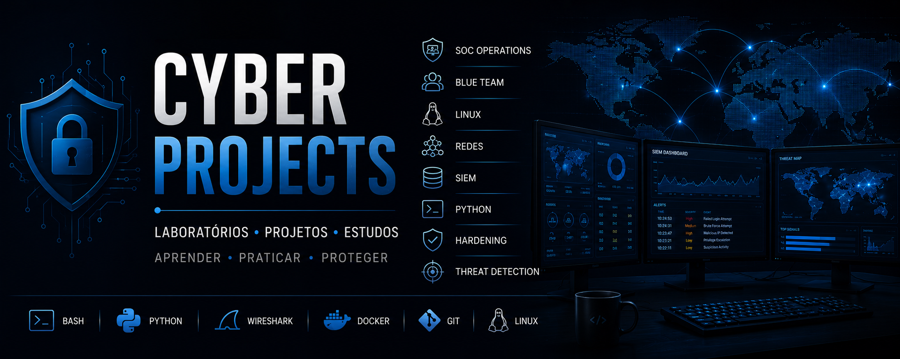

# Olá, eu sou Vinicius Bibiano 👋

🔐 Aprendiz SOC | Blue Team | Cybersecurity

Atualmente atuando na área de Segurança da Informação e estudando:

- Linux
- Redes
- SIEM
- Python
- Hardening
- Análise de Logs
- Segurança Ofensiva e Defensiva

---

## 🚀 Projetos em Destaque

### 🔹 WordPress Security Lab
Laboratório de segurança focado em WordPress, hardening e análise de vulnerabilidades.

### 🔹 Phishing Awareness Campaign
Projeto educacional sobre conscientização contra phishing.

### 🔹 GNS3 Network Lab
Laboratórios de redes utilizando GNS3 para estudos de infraestrutura e segurança.

### 🔹 Linux Hardening
Aplicação de práticas de segurança e configuração segura em Linux.

---

## 📚 Atualmente estudando

- ISO 27001
- SOC Operations
- Cybersecurity
- Redes
- Python para Segurança

---

## 📫 Contato

LinkedIn:
https://www.linkedin.com/in/vinicius-augusto-bibiano/
