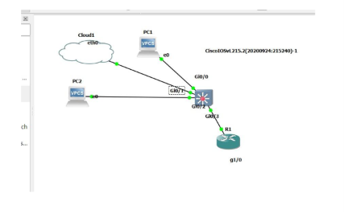
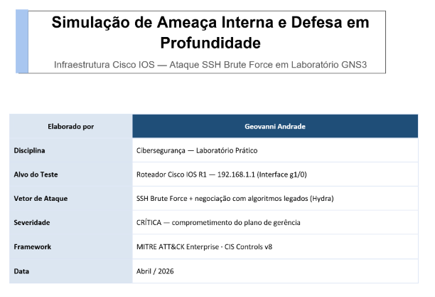
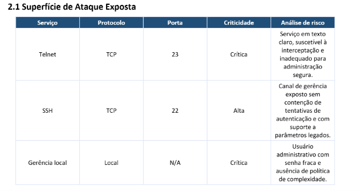
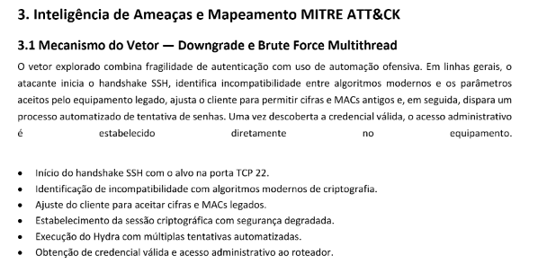
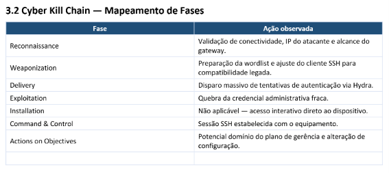

# 🛡️ Cisco SSH Brute Force Threat Simulation

Simulação prática de ameaça interna utilizando
SSH Brute Force contra infraestrutura Cisco IOS
em ambiente controlado no GNS3.

---

# 🎯 Objetivo

Demonstrar técnicas de reconhecimento,
enumeração e exploração de autenticação fraca
em equipamentos de rede.

O laboratório também aborda conceitos de:

- MITRE ATT&CK
- Cyber Kill Chain
- Defesa em profundidade
- Hardening
- Threat Intelligence

---

# 🛠️ Tecnologias Utilizadas

- GNS3
- Kali Linux
- Cisco IOS
- Hydra
- SSH
- Linux

---

# 🌐 Topologia do Ambiente

---

# 📋 Escopo do Laboratório

---

# ⚠️ Superfície de Ataque

---

# 🧠 Inteligência de Ameaças — MITRE ATT&CK

---

# 🔗 Cyber Kill Chain

---

# 🔍 Técnicas Simuladas

- Reconhecimento de serviços
- Enumeração SSH
- Ataque de força bruta
- Negociação com algoritmos legados
- Obtenção de acesso administrativo
- Pós-exploração controlada

---

# 🛡️ Conceitos Defensivos

- Hardening SSH
- Desativação de algoritmos legados
- Política forte de senhas
- Controle de acesso administrativo
- Segmentação de rede
- Monitoramento de autenticação

---

# 📚 Conceitos Trabalhados

- Threat Intelligence
- MITRE ATT&CK
- Cyber Kill Chain
- Segurança de Infraestrutura
- Hardening
- Segurança Ofensiva
- Segurança Defensiva

---

# ⚠️ Aviso

Projeto desenvolvido exclusivamente para fins
educacionais em ambiente controlado.

Nenhuma atividade foi realizada contra
infraestruturas reais.

---

# 👨‍💻 Autor

Vinicius Bibiano
