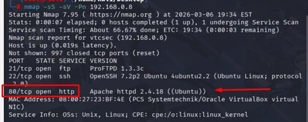
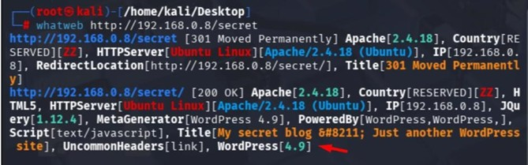
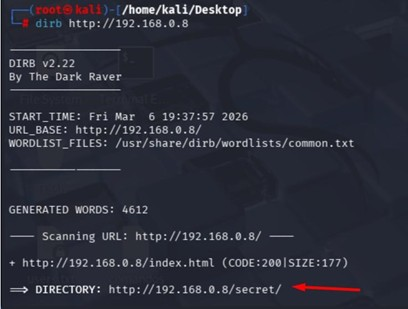
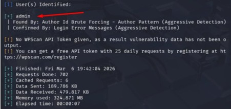
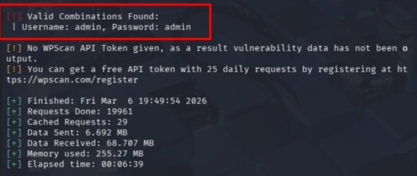
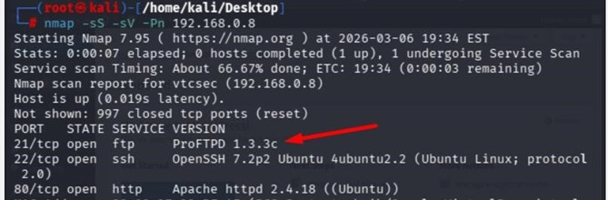
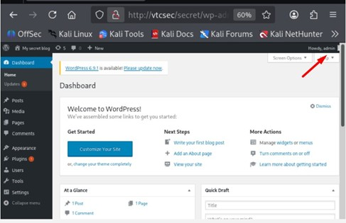
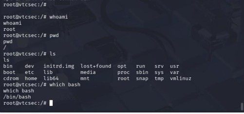

# 🔎 Metasploitable Pentest Lab

Laboratório prático focado em reconhecimento, enumeração,
identificação de vulnerabilidades e exploração controlada
em ambiente Metasploitable.

---

# 🎯 Objetivo

Demonstrar técnicas utilizadas durante um processo
de Pentest e análise de vulnerabilidades em ambiente controlado.

---

# 🛠️ Ferramentas Utilizadas

- Nmap
- WhatWeb
- Dirb
- WPScan
- Metasploit Framework
- Kali Linux

---

# 🌐 Reconhecimento Inicial

Identificação de serviços ativos utilizando Nmap.

---

# 🔍 Fingerprinting da Aplicação

Identificação da tecnologia web utilizando WhatWeb.

---

# 📂 Enumeração de Diretórios

Descoberta de diretórios ocultos utilizando Dirb.

---

# 👤 Enumeração de Usuários WordPress

Identificação de usuários válidos utilizando WPScan.

---

# 🔑 Ataque de Bruteforce

Teste controlado de credenciais utilizando WPScan.

---

# 🖥️ Acesso Administrativo

Acesso autenticado ao painel WordPress em ambiente controlado.

---

# 🚨 Serviço Vulnerável Identificado

Identificação do serviço ProFTPD vulnerável.

---

# ⚔️ Exploração Controlada

Configuração do exploit utilizando Metasploit Framework.

---

# 💀 Pós-Exploração

Execução controlada após obtenção de shell.

---

# ⚠️ Aviso

Projeto realizado exclusivamente para fins educacionais
e em ambiente controlado.

Nenhuma atividade foi executada contra ambientes reais.

---

# 👨‍💻 Autor

Vinicius Bibiano

Projeto desenvolvido para fins de estudo em Cybersecurity,
Pentest e Análise de Vulnerabilidades.
