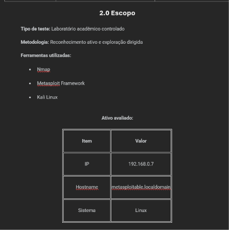
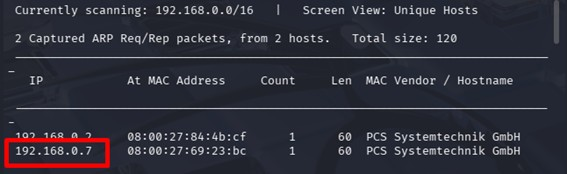
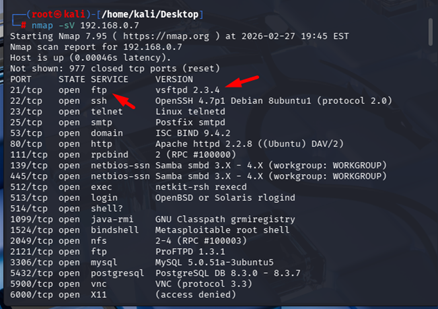
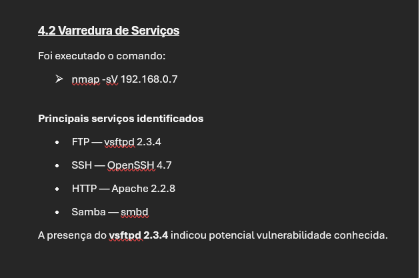
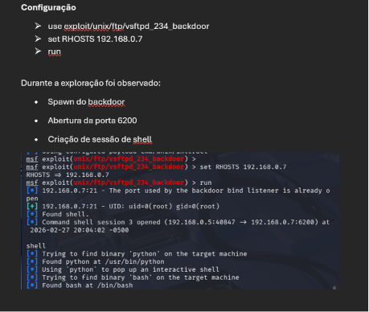
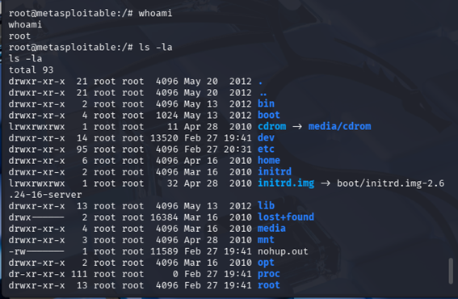

# 💀 VSFTPD 2.3.4 Exploit Lab

Laboratório prático focado na identificação e exploração
da vulnerabilidade VSFTPD 2.3.4 Backdoor
em ambiente controlado.

---

# 🎯 Objetivo

Demonstrar o processo de reconhecimento,
enumeração e exploração da vulnerabilidade
VSFTPD 2.3.4 Backdoor.

---

# 📋 Escopo

---

# 🌐 Descoberta do Host

---

# 🔎 Enumeração de Serviços

---

# 📊 Varredura de Serviços

---

# ⚔️ Configuração do Exploit

---

# 💀 Pós-Exploração

---

# ⚠️ Aviso

Projeto desenvolvido exclusivamente para fins educacionais
em ambiente controlado.

Nenhuma atividade foi realizada contra ambientes reais.

---

# 👨‍💻 Autor

Vinicius Bibiano
