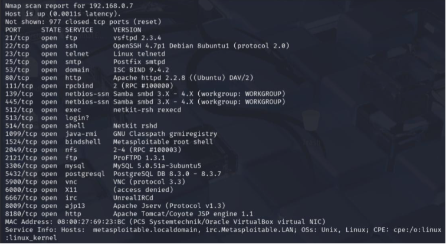
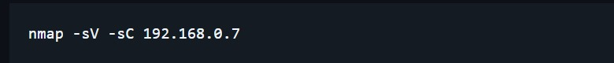
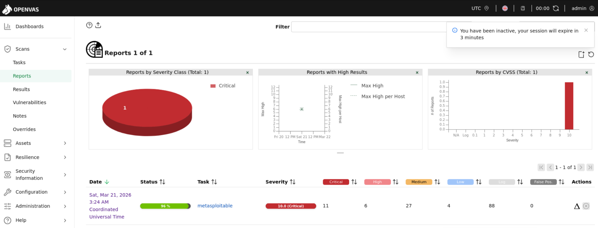

---

# 📸 Evidências do Laboratório

---

## 🔎 Enumeração de serviços com Nmap

Mapeamento inicial de serviços e portas expostas
no host analisado.

---

## 💻 Comando utilizado

Execução do Nmap utilizando detecção de serviços
e scripts padrão.

---

## 🛡️ Dashboard OpenVAS

Visualização do relatório de vulnerabilidades
identificadas durante o scan.

---

## 🚨 Vulnerabilidades encontradas

Análise detalhada das vulnerabilidades críticas
detectadas no ambiente.

---

# 🛡️ Mitigações estudadas

- Atualização de serviços
- Hardening
- Correção de vulnerabilidades
- Segmentação de rede
- Monitoramento contínuo

---

# 📚 Aprendizados

Durante o laboratório foi possível compreender
o funcionamento de scanners de vulnerabilidades
e a importância da gestão contínua de falhas
em ambientes corporativos.

---

# 👥 Créditos

Projeto desenvolvido em conjunto com Geovanni Andrade
durante estudos práticos e laboratoriais em Cybersecurity.
