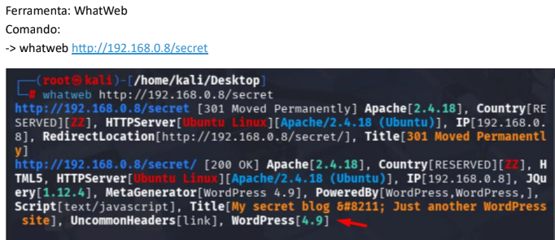
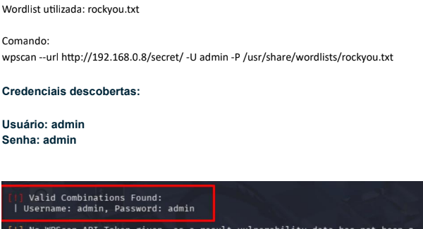
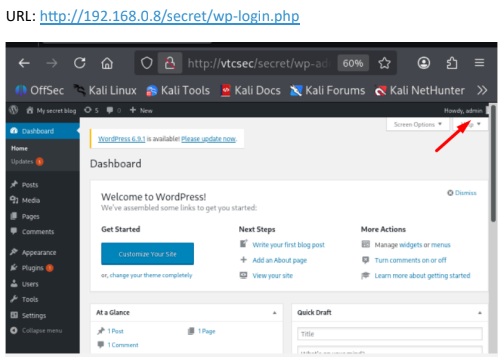

# 📸 Evidências do Laboratório

---

## 🔎 Reconhecimento inicial com Nmap

Mapeamento inicial do host e identificação
de portas e serviços ativos.

---

## 📂 Enumeração de diretórios com Dirb

Identificação de diretórios ocultos
na aplicação web.

---

## 🌐 Fingerprinting com WhatWeb

Identificação das tecnologias utilizadas
na aplicação WordPress.

---

## 👤 Enumeração de usuários com WPScan

Identificação de usuários válidos
na aplicação WordPress.

---

## 🔐 Teste de credenciais com WPScan

Análise de senhas fracas utilizando
wordlists em ambiente controlado.

---

## 🖥️ Acesso administrativo ao WordPress

Validação do acesso utilizando
credenciais identificadas durante o laboratório.

---

# 🛡️ Mitigações estudadas

- Uso de senhas fortes
- Restrição de acesso administrativo
- Hardening WordPress
- Atualização de plugins e temas
- Monitoramento de autenticação
- Desativação de enumeração de usuários

---

# 📚 Aprendizados

Durante o laboratório foi possível compreender
técnicas de reconhecimento, enumeração
e análise de vulnerabilidades em aplicações web,
além da importância de políticas seguras
de autenticação.

---

# 👥 Créditos

Projeto desenvolvido em conjunto com Geovanni Andrade
durante estudos práticos e laboratoriais em Cybersecurity.
